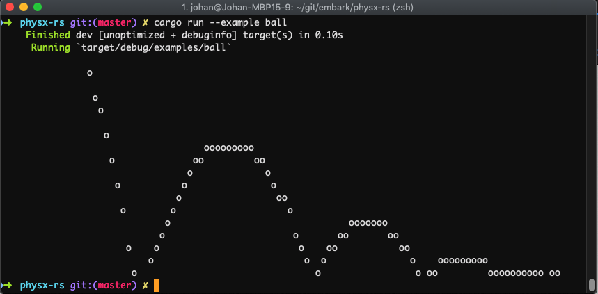

# 🎳 physx-rs

[](https://travis-ci.com/EmbarkStudios/physx-rs)

Rust binding and wrapper over [NVIDIA PhysX](https://github.com/NVIDIAGameWorks/PhysX), a popular and mature physics engine particularly well-suited for games.

Created and mantained by [Embark](http://embark.games) and _**not**_ officially supported by NVIDIA.

This repository contains 3 crates:

| Name | Description | Links |
| --- | --- | --- |
| [`physx`](physx/) | High-level interface on top of `physx-sys` 🚧 | [](https://crates.io/crates/physx) [](https://docs.rs/physx) |
| [`physx-sys`](physx-sys/) | Unsafe bindings to the PhysX C++ API | [](https://crates.io/crates/physx-sys) [](https://docs.rs/physx-sys) |
| [`physx-macros`](physx-macros/) | Utility macros used internally by the `physx` crate | [](https://crates.io/crates/physx-macros) [](https://docs.rs/physx-macros) |

Our goal is that one should be able to only use the safe `physx` crate. It is still in early development hovewer, and doesn't provide full coverage yet 🚧 (tracked in [#3](https://github.com/EmbarkStudios/physx-rs/issues/3)). Right now to access certain features requires one to use it in conjunction with the unsafe and cumbersome `physx-sys` crate.

## Why?

* You want a feature-rich and performant physics engine to use in your project.

## Why not?

* It's a large C++ codebase which requires a C++ toolchain, and comes with a non-trivial build system.

* The high-level `physx` wrapper is work-in-progress, and only covers a part of PhysX functionality with a Rustified interface.

### Alternatives

* [nphysics](https://github.com/rustsim/nphysics) a 2 and 3-dimensional physics engine for games and animations written in Rust. (TODO default to this unless you really want physx)

## How?

The PhysX user guide can be found [here](https://gameworksdocs.nvidia.com/PhysX/4.1/documentation/physxguide/Manual/Introduction.html). The official C++ API maps very closely to the low-level interface provided by the `physx-sys` crate. We also provide a (work in progress :construction:) higher-level API which utilizes Rust patterns, and leverages safety of the language. For example, initialization code becomes:


``` Rust
const PX_PHYSICS_VERSION: u32 = (4 << 24) + (1 << 16);
let mut foundation = Foundation::new(PX_PHYSICS_VERSION);

let mut physics = PhysicsBuilder::default()
    .load_extensions(false) // switch this flag to load extensions during setup
    .build(&mut foundation);

let mut scene = physics.create_scene(
    SceneBuilder::default()
        .set_gravity(glm::vec3(0.0, -9.81, 0.0))
        .set_simulation_threading(SimulationThreadType::Dedicated(1)),
);
```

Please refer to `physx` crate docs for more information.

You can run an example with `cargo run --example ball`, which should show the following output:



## Prerequisites

* C++ compiler
* CMake

## How does it work?

TODO: Some high-level info about how the wrapper is constructed, and how we wrap inheritance stuffs? Uses `physx-sys` as a low-level blabla.

## Features

TODO: List of currently supported PhysX stuff at the high level?

## License

Licensed under either of

* Apache License, Version 2.0, ([LICENSE-APACHE](LICENSE-APACHE) or http://www.apache.org/licenses/LICENSE-2.0)
* MIT license ([LICENSE-MIT](LICENSE-MIT) or http://opensource.org/licenses/MIT)

at your option.

### Contribution

Unless you explicitly state otherwise, any contribution intentionally
submitted for inclusion in the work by you, as defined in the Apache-2.0
license, shall be dual licensed as above, without any additional terms or
conditions.
